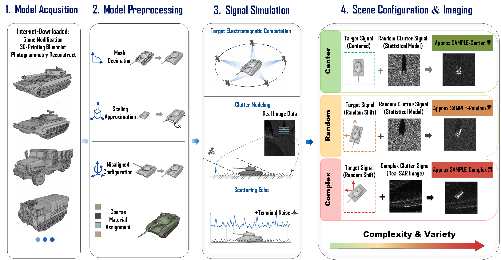
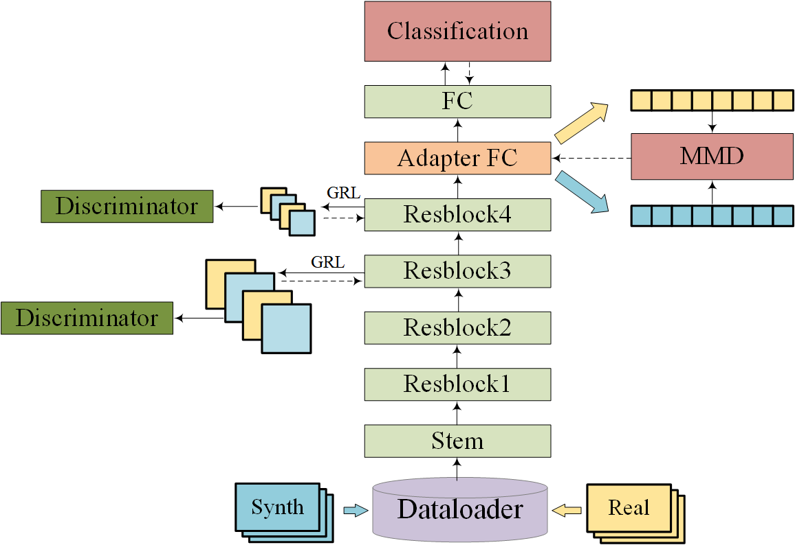

# Approx SAMPLE: Towards Non-Cooperative  SAR-ATR via Controllable Approximate Simulation

<div align=center>

</div>

### 📖 Introduction

**Approx SAMPLE** is a benchmark dataset designed explicitly for **Non-Cooperative SAR Automatic Target Recognition (SAR-ATR)**.  
While existing datasets like SAMPLE rely on precisely-aligned synthetic and measured SAR image pairs (exact 3D models, precise registration), such ideal assumptions are unrealistic in non-cooperative scenarios where target geometry, material, and background are uncertain.

We propose a **controllable approximate simulation framework** to systematically introduce:
- **Limited geometric fidelity** (open-source 3D models, mesh decimation, approximate scaling)
- **Material approximations** (PEC with local dielectric corrections)
- **Randomized target placements** (breaking pixel-level registration)
- **Complex background clutter** (real SAR image-driven clutter synthesis)

The resulting dataset retains physical electromagnetic consistency while explicitly featuring the misalignment and uncertainty typical of non-cooperative settings, enabling more robust evaluation of cross-domain SAR-ATR algorithms.

### 🔑 Key Features
- **Progressive difficulty**: Three configurations (`Center`, `Random`, `Complex`)
- **Real-image-driven clutter**: Backgrounds synthesized from real SAR imagery
- **Multi-level annotations**: SAR images, quarter-power reflectivity maps, target shadow masks, and orthographic projection masks
- **Class-aligned with SAMPLE**: 10 target classes (2S1, BMP2, BTR70, M1, M2, M35, M548, M60, T72, ZSU23)
- **Open-source & white-box**: Full construction pipeline, desktop-grade simulation (CST), no HPC require
> **🗂️ Note**: The full dataset will be publicly released upon paper publication. For now, please refer to the [example](./example) folder for sample data.
<div align=center>
  
  
  
</div>

### 🔬 Our Exploration on Approx SAMPLE and SAMPLE

We leverage **Approx SAMPLE** to iteratively upgrade the baseline ([ResNet18 + MMD](https://github.com/TheGreatTreatsby/SAMPLE_MMD)) from previous work. One of our evolved versions inserts a **Gradient Reversal Layer (GRL)** after the last two convolutional blocks to deliberately confuse cross-domain feature distributions. The model architecture is illustrated below:

<div align=center>
  
</div>

This simple yet effective design achieves **~75% accuracy** on Approx SAMPLE. More surprisingly, **without any pseudo-label denoising rules or well-designed auxiliary features**, this model attains **state-of-the-art results** across multiple scenarios on the original SAMPLE dataset.

We interpret this as strong evidence that:
- **Strong domain-shift benchmarks** (like Approx SAMPLE) can **positively promote** cross-domain adaptation algorithms — the improvements learned to overcome severe shifts on Approx SAMPLE **transfer beneficially** to SAMPLE, where the domain gap is milder.
- Conversely, it further **corroborates the structural limitations of SAMPLE**: once the stylistic discrepancy is bridged, the highly-registered simulated–real pairs in SAMPLE behave as if drawn from the same distribution, lending further support to the view that recognition algorithms benefit to a considerable extent from the registration shortcut inherent in SAMPLE.

### 🧪 Reproduce SOTA Results on SAMPLE
+------------+-----------------------------------------------------+---------------------+
| Scenario   | Train Set (labeled Synthetic + unlabeled Measured)  | Test Set            |
+------------+-----------------------------------------------------+---------------------+
| I          | Synthetic (14°–17°) + Measured (14°–17°)            | Measured (14°–17°)  |
+------------+-----------------------------------------------------+---------------------+
| II         | Synthetic (14°–16°) + Measured (17°)                | Measured (17°)      |
+------------+-----------------------------------------------------+---------------------+
| III        | Synthetic (14°–17°) + Measured (14°–16°)            | Measured (17°)      |
+------------+-----------------------------------------------------+---------------------+
You can reproduce the following results by running:

```bash
python resnet+MMD+GRL_for_SAMPLE.py --config /path/to/your/secen1.yaml
python resnet+MMD+GRL_for_SAMPLE.py --config /path/to/your/secen2.yaml
python resnet+MMD+GRL_for_SAMPLE.py --config /path/to/your/secen3.yaml

Scenario	        Accuracy	          resnet18+MMD+GRL
I       	Min / Max / Avg±std	    98.66 / 100.00 / 99.57 ± 0.31
II      	Min / Max / Avg±std   	98.14 / 99.63 / 99.17 ± 0.40
III     	Min / Max / Avg±std   	99.26 / 100.00 / 99.85 ± 0.18
